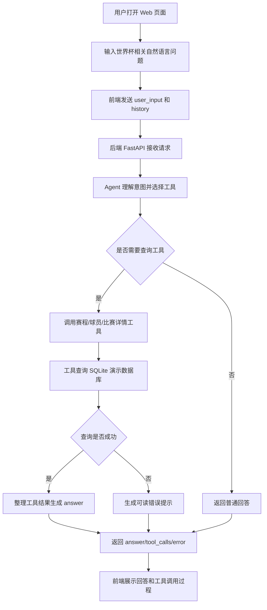
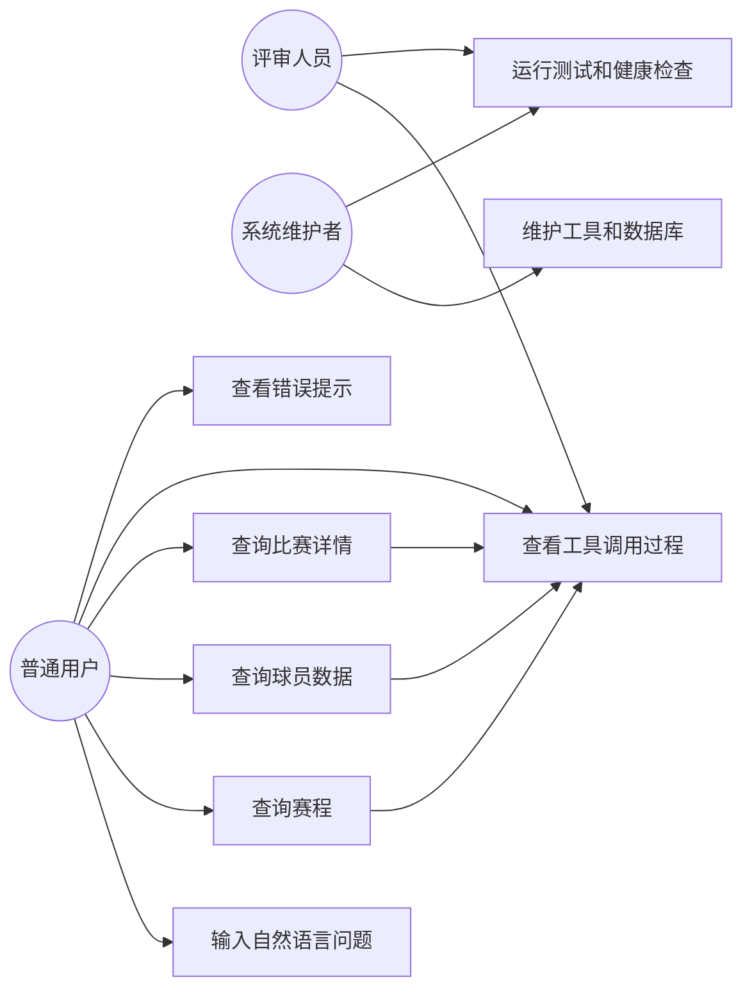
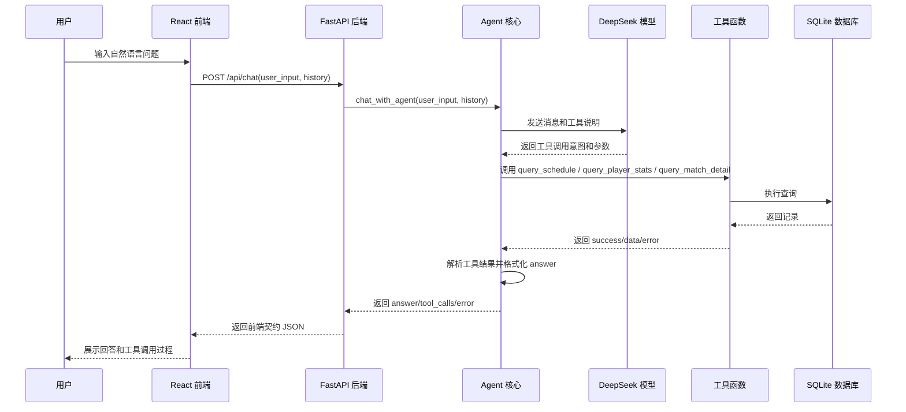
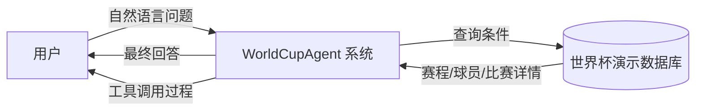
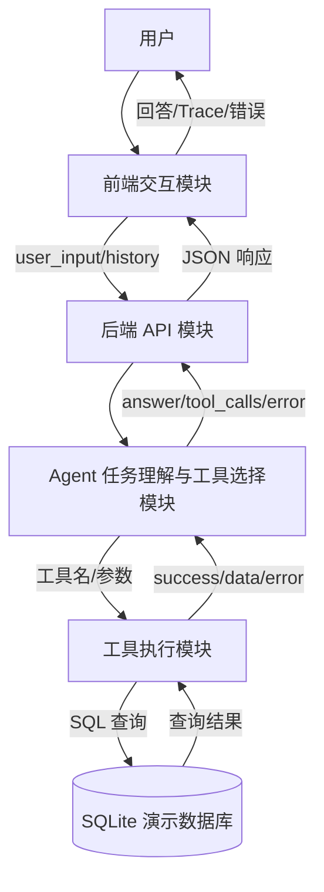
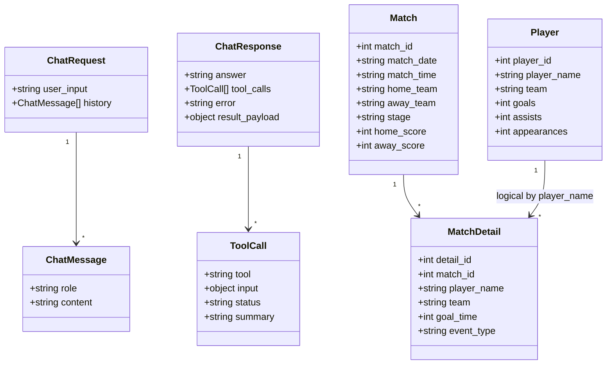
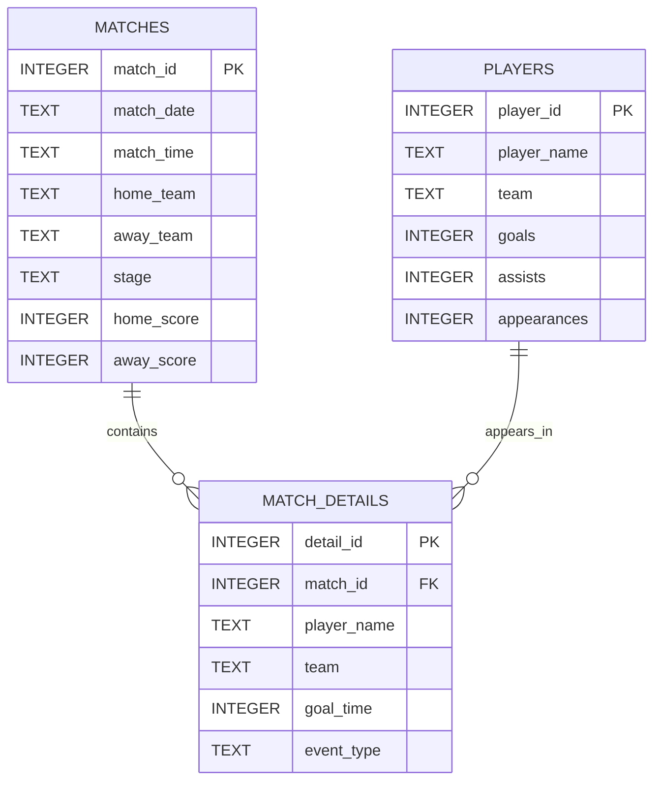

# WorldCupAgent 需求规格说明书

| 项目 | 内容 |
|---|---|
| 系统名称 | WorldCupAgent 世界杯工具调用智能体 |
| 选题 | 基于大模型的工具调用智能体 |
| 业务场景 | 世界杯赛事信息查询与工具调用过程展示 |
| 文档版本 | v1.0 |
| 编写日期 | 2026-07-07 |
| 小组成员 | 郑梓湃、李文杰、田佳瑛 |

## 1. 引言

### 1.1 编写目的

本文档用于说明 WorldCupAgent 的用户需求、功能需求、需求分析模型、数据模型和非功能性需求。文档面向课程评审、开发成员和测试成员，作为后续系统设计、编码实现、测试用例设计和答辩演示的依据。

### 1.2 项目背景

课程选题要求实现一个“基于大模型的工具调用智能体”。系统应区别于普通问答系统，体现“理解任务—制定计划—调用工具—观察结果—生成回答”的智能体工作流程。

本项目选择“世界杯赛事信息查询”作为具体业务场景。用户通过自然语言提出赛程、球员数据、比赛详情等问题，系统由大模型识别意图并选择工具，工具查询本地 SQLite 课程演示数据库，最终向用户展示回答和工具调用过程。

### 1.3 项目范围

本阶段系统范围包括：

- 自然语言赛事查询；
- 赛程查询；
- 球员统计查询；
- 比赛详情查询；
- 多轮对话历史传入；
- 工具调用过程展示；
- 查询失败、输入为空、工具失败等异常提示；
- Web 前端交互界面；
- 基于本地 SQLite 课程演示数据库的数据查询。

本阶段不包括：

- 用户注册、登录、权限系统；
- 官方实时比赛数据接入；
- 积分榜、射手榜、直播文字流等扩展功能；
- 长期保存用户历史对话；
- 支付、分享、推送通知等非核心业务。

## 2. 用户需求说明

### 2.1 用户角色

| 用户角色 | 说明 | 主要目标 |
|---|---|---|
| 普通用户 | 使用 Web 页面提出世界杯相关问题的用户 | 用自然语言快速获取赛程、球员数据和比赛详情 |
| 演示/评审人员 | 课程验收时观察系统功能的人 | 看到智能体不是普通问答，而是会调用工具并展示过程 |
| 系统维护者 | 维护工具、数据库、后端配置和测试的开发成员 | 保证工具接口、数据库和前后端契约稳定 |

### 2.2 业务需求

#### BR-01 自然语言查询

用户希望不学习数据库字段和工具参数，直接用自然语言提问。例如：

- “请查询巴西队赛程”
- “请查询梅西的世界杯进球数据”
- “请查询阿根廷和佛得角的比赛详情”

系统应理解用户意图，并选择合适工具完成查询。

#### BR-02 工具调用过程透明

用户和评审人员希望看到系统调用了什么工具、传入了什么参数、工具执行是否成功以及返回了什么摘要。系统应在前端展示工具调用过程，证明其具备智能体流程，而不是单纯生成文本。

#### BR-03 结果可信

用户希望查询结果来自明确数据源。系统应基于本地 SQLite 课程演示数据库返回结果，并说明该数据不代表官方实时数据。

#### BR-04 异常可理解

当用户输入为空、查询不到数据、工具参数不足、模型服务不可用时，系统应给出清晰提示，而不是直接崩溃或返回程序错误堆栈。

#### BR-05 多轮对话支持

用户希望在一次对话中继续追问。前端应维护历史消息，并在请求后端时传入 `history`，使 Agent 能参考上下文处理后续问题。

### 2.3 User Story

| 编号 | User Story | 验收标准 |
|---|---|---|
| US-01 | 作为普通用户，我希望输入一句自然语言问题，就能查询世界杯赛程。 | 输入“请查询巴西队赛程”后，系统返回巴西相关赛程，并展示 `query_schedule` 工具调用记录。 |
| US-02 | 作为普通用户，我希望查询球员统计数据。 | 输入“请查询梅西的世界杯进球数据”后，系统返回球员、球队、进球、助攻、出场次数等字段。 |
| US-03 | 作为普通用户，我希望查询单场比赛详情。 | 输入“请查询阿根廷和佛得角的比赛详情”后，系统返回比分、阶段、时间和进球记录。 |
| US-04 | 作为评审人员，我希望看到工具调用过程。 | 前端 Trace 面板展示工具名称、参数、状态和结果摘要。 |
| US-05 | 作为用户，我希望错误提示能看懂。 | 空输入、查询不到球员或工具失败时，页面展示可读错误信息。 |
| US-06 | 作为用户，我希望系统不要编造数据。 | 工具未返回的事实不得由模型自行补充；工具型回答只整理工具结果字段。 |

### 2.4 业务流程图

## 3. 功能性需求

### 3.1 功能需求列表

| 编号 | 功能需求 | 优先级 | 说明 |
|---|---|---|---|
| FR-01 | 自然语言输入 | 高 | 用户可通过 Web 文本框输入世界杯相关问题。 |
| FR-02 | 对话历史传入 | 高 | 前端维护 `history`，每次请求传给后端。 |
| FR-03 | 赛程查询工具 | 高 | 支持按球队、日期、阶段查询赛程。 |
| FR-04 | 球员数据查询工具 | 高 | 支持按球员姓名查询球队、进球、助攻、出场次数。 |
| FR-05 | 比赛详情查询工具 | 高 | 支持按比赛 ID 或主客队查询比分和进球记录。 |
| FR-06 | 工具选择 | 高 | Agent 根据用户问题选择合适工具和参数。 |
| FR-07 | 工具调用过程展示 | 高 | 前端展示工具名、输入、状态和摘要。 |
| FR-08 | 工具型回答收敛 | 高 | 对工具型问题，最终回答只基于工具返回字段。 |
| FR-09 | 错误处理 | 高 | 空输入、无数据、工具失败、模型异常均返回稳定结构。 |
| FR-10 | Web 可视化界面 | 高 | 页面展示用户输入、系统回答、工具过程和错误状态。 |
| FR-11 | 示例问题入口 | 中 | 前端提供赛程、球员、比赛详情等示例问题，方便演示。 |
| FR-12 | 系统健康检查 | 中 | 后端提供 `/api/health` 用于确认服务在线。 |

### 3.2 功能范围与扩展边界

本版本聚焦完成“自然语言输入—Agent 工具选择—数据库查询—结果生成—过程展示”的核心闭环，优先保证工具调用智能体的主要能力可演示、可测试、可解释。

- 数据源采用本地 SQLite 课程演示库，保证演示结果稳定可复现；后续可将工具层替换或扩展为官方赛事 API、第三方实时数据源或更完整的数据仓库；
- 对话能力通过前端 `history` 和后端 `/api/chat` 接口支持多轮上下文传入；当前不引入账号体系和长期历史存储，后续可扩展为用户画像、收藏记录和个性化提醒；
- 前端页面承担产品化展示和真实查询入口两类职责：静态示例用于展示赛事助手形态，查询页通过 `/api/chat` 展示真实 Agent 调用流程；
- `result_payload` 作为结构化结果展示的扩展点；当前版本已由后端返回赛程、球员、排行、门将和比赛详情等结构化数据，前端可按 `mode` 逐步渲染卡片或表格。

## 4. 需求分析建模

### 4.1 用例图

### 4.2 核心查询时序图

### 4.3 数据流图

#### 4.3.1 上下文级数据流图

#### 4.3.2 一层数据流图

### 4.4 领域类图

## 5. 数据建模

### 5.1 ER 图

说明：

- `matches` 保存比赛基础信息；
- `players` 保存球员统计信息；
- `match_details` 保存比赛进球事件，通过 `match_id` 关联比赛；
- 当前 SQLite 表中未单独建立 `teams` 表，球队名称以文本字段形式保存在比赛、球员和进球事件中；
- `match_details.player_name` 与 `players.player_name` 在业务上存在逻辑关联，但当前数据库未强制外键约束；
- `sqlite_sequence` 是 SQLite 内部表，不属于业务 ER 模型。

### 5.2 数据字典：matches 表

| 字段名 | 数据类型 | 是否主键 | 是否可空 | 含义 | 示例 |
|---|---|---|---|---|---|
| `match_id` | INTEGER | 是 | 否 | 比赛唯一标识 | `91` |
| `match_date` | TEXT | 否 | 否 | 比赛日期，格式 `YYYY-MM-DD` | `2026-07-06` |
| `match_time` | TEXT | 否 | 否 | 比赛时间，格式 `HH:MM` | `04:00` |
| `home_team` | TEXT | 否 | 否 | 主队名称 | `巴西` |
| `away_team` | TEXT | 否 | 否 | 客队名称 | `挪威` |
| `stage` | TEXT | 否 | 否 | 比赛阶段 | `1/8决赛` |
| `home_score` | INTEGER | 否 | 是 | 主队得分 | `1` |
| `away_score` | INTEGER | 否 | 是 | 客队得分 | `2` |

### 5.3 数据字典：players 表

| 字段名 | 数据类型 | 是否主键 | 是否可空 | 默认值 | 含义 | 示例 |
|---|---|---|---|---|---|---|
| `player_id` | INTEGER | 是 | 否 | 无 | 球员唯一标识 | `1` |
| `player_name` | TEXT | 否 | 否 | 无 | 球员姓名 | `梅西` |
| `team` | TEXT | 否 | 否 | 无 | 所属球队 | `阿根廷` |
| `goals` | INTEGER | 否 | 是 | `0` | 进球数 | `7` |
| `assists` | INTEGER | 否 | 是 | `0` | 助攻数 | `3` |
| `appearances` | INTEGER | 否 | 是 | `0` | 出场次数 | `5` |

### 5.4 数据字典：match_details 表

| 字段名 | 数据类型 | 是否主键 | 是否可空 | 默认值 | 含义 | 示例 |
|---|---|---|---|---|---|---|
| `detail_id` | INTEGER | 是 | 否 | 无 | 比赛事件唯一标识 | `63` |
| `match_id` | INTEGER | 否 | 否 | 无 | 所属比赛 ID，关联 `matches.match_id` | `91` |
| `player_name` | TEXT | 否 | 否 | 无 | 事件相关球员姓名 | `哈兰德` |
| `team` | TEXT | 否 | 否 | 无 | 事件所属球队 | `挪威` |
| `goal_time` | INTEGER | 否 | 否 | 无 | 进球发生时间，单位为比赛分钟 | `79` |
| `event_type` | TEXT | 否 | 是 | `goal` | 事件类型，如普通进球或乌龙球 | `goal`、`own_goal` |

### 5.5 接口数据字典

#### 5.5.1 ChatRequest

| 字段名 | 类型 | 是否必填 | 含义 |
|---|---|---|---|
| `user_input` | string | 是 | 用户本轮自然语言输入 |
| `history` | ChatMessage[] | 否 | 前端维护的对话历史 |

#### 5.5.2 ChatMessage

| 字段名 | 类型 | 是否必填 | 取值范围 | 含义 |
|---|---|---|---|---|
| `role` | string | 是 | `user` / `assistant` | 消息角色 |
| `content` | string | 是 | 文本 | 消息内容 |

#### 5.5.3 ChatResponse

| 字段名 | 类型 | 是否必填 | 含义 |
|---|---|---|---|
| `answer` | string | 是 | 面向用户展示的最终回答 |
| `tool_calls` | ToolCall[] | 是 | 本轮工具调用过程 |
| `error` | string / null | 否 | 系统级或业务级错误提示 |
| `result_payload` | object / null | 否 | 可选结构化展示数据；可包含 `mode/title/summary/source_tools/data`，无合适结构时为 null |

#### 5.5.4 ToolCall

| 字段名 | 类型 | 是否必填 | 取值范围 | 含义 |
|---|---|---|---|---|
| `tool` | string | 是 | 工具名称 | 被调用的工具，如 `query_schedule` |
| `input` | object | 是 | JSON 对象 | 工具输入参数 |
| `status` | string | 是 | `success` / `failed` | 工具调用状态 |
| `summary` | string | 是 | 文本 | 工具结果摘要或错误摘要 |

### 5.6 工具数据字典

| 工具名 | 输入参数 | 返回数据 | 失败情况 |
|---|---|---|---|
| `query_schedule` | `team?: string`、`date?: string`、`stage?: string` | 赛程列表：日期、时间、主队、客队、阶段、比分 | 无匹配赛程或数据库异常 |
| `query_player_stats` | `player_name: string` | 球员、球队、进球、助攻、出场次数 | 无该球员或数据库异常 |
| `query_match_detail` | `match_id?: int` 或 `home_team?: string, away_team?: string` | 比赛 ID、日期、时间、阶段、比分、进球事件 | 参数不足、无匹配比赛或数据库异常 |

## 6. 非功能性需求

### 6.1 开发环境

| 项目 | 要求 |
|---|---|
| 操作系统 | macOS / Windows / Linux 均可，当前开发环境为 macOS |
| 版本控制 | Git + GitHub |
| 后端语言 | Python 3.12 |
| 前端语言 | JavaScript |
| 前端框架 | React + Vite |
| 数据库 | SQLite |
| 包管理 | pip、npm |
| 测试工具 | pytest、工具自测脚本、前端构建检查 |

### 6.2 运行环境

| 模块 | 运行方式 |
|---|---|
| 后端 API | `uvicorn backend.app:app --reload --port 8000` |
| 前端页面 | `cd frontend && npm install && npm run dev` |
| 命令行 Demo | `python agent.py` |
| 工具自测 | `python test_tools.py` |
| 自动测试 | `python -m pytest -q` |

### 6.3 系统依赖项

#### 后端依赖

| 依赖 | 用途 |
|---|---|
| `langchain` | 构建 Agent 与工具调用流程 |
| `langchain-deepseek` | 接入 DeepSeek 模型 |
| `python-dotenv` | 从 `.env` 加载环境变量 |
| `fastapi` | 提供 HTTP API |
| `uvicorn` | 运行 FastAPI 服务 |
| `pytest` | 自动化测试 |
| SQLite 标准库 | 查询本地演示数据库 |

#### 前端依赖

| 依赖 | 用途 |
|---|---|
| `react` / `react-dom` | 前端界面开发 |
| `react-router-dom` | 页面路由 |
| `antd` | UI 组件 |
| `@ant-design/icons` | 图标 |
| `vite` | 前端开发服务器与构建 |
| `@vitejs/plugin-react` | Vite React 支持 |

#### 外部配置

| 配置项 | 是否必需 | 说明 |
|---|---|---|
| `DEEPSEEK_API_KEY` | 是 | 调用 DeepSeek 模型所需密钥，写入 `.env`，不得提交到 GitHub |
| `VITE_API_BASE_URL` | 否 | 前端可选配置，默认使用 `http://localhost:8000` |

### 6.4 性能需求

- 在本地开发环境下，普通查询应在用户可接受时间内返回；
- 由于大模型调用依赖网络和第三方服务，前端应显示加载状态；
- 后端模型调用设置超时和重试，避免请求无限等待；
- 自动测试不依赖真实模型，保证测试速度和稳定性。

### 6.5 可用性需求

- 页面应提供示例问题，降低用户输入门槛；
- 错误提示应使用自然语言，不直接暴露 Python 异常堆栈给普通用户；
- 工具调用过程应可读，方便课程演示；
- 首页演示数据必须明确标注为本地课程演示数据，避免误导为官方实时数据。

### 6.6 安全性需求

- 不提交 `.env`、API Key 或其他密钥；
- 前端不展示模型隐藏思维链、完整 Prompt、密钥和未经处理的内部日志；
- 工具查询使用参数化 SQL，避免直接拼接用户输入；
- 前端只传 `{role, content}` 形式的对话历史，不传组件内部状态。

### 6.7 可靠性与可维护性需求

- 工具统一返回 `success / data / error`，便于 Agent 统一处理；
- 后端统一返回 `answer / tool_calls / error / result_payload`，便于前端稳定接入；
- 工具型回答由代码根据工具结果格式化，降低模型幻觉风险；
- 每个工具应可独立测试；
- 系统应保留测试用例和缺陷记录，支持后续报告与答辩。

## 7. 需求验收标准

| 验收项 | 验收方式 |
|---|---|
| 支持自然语言查询 | 在前端输入问题并得到回答 |
| 支持世界杯查询工具集 | 分别查询赛程、球员数据、球员排行、队内最佳射手、门将扑救和比赛详情 |
| 展示工具调用过程 | Trace 面板展示工具名、参数、状态、摘要 |
| 错误输入可处理 | 空输入或无数据查询时显示错误提示 |
| 不编造工具外事实 | 工具型回答只包含工具返回字段 |
| Web 可视化界面可运行 | 前端和后端同时启动后能完成端到端查询 |
| 测试不少于 10 条 | pytest 和系统测试记录覆盖核心场景 |
| 数据建模完整 | ER 图和数据字典覆盖所有业务数据表 |

## 8. 需求追踪矩阵

| 需求编号 | 对应模型 | 对应实现模块 | 对应测试方向 |
|---|---|---|---|
| FR-01 | 业务流程图、用例图 | `frontend/src/pages/QueryPage.jsx` | 输入正常问题 |
| FR-02 | 时序图、接口数据字典 | `ChatRequest.history` | 多轮对话 |
| FR-03 | DFD、ER 图 | `query_schedule`、`matches` | 赛程查询 |
| FR-04 | DFD、ER 图 | `query_player_stats`、`players` | 球员数据查询 |
| FR-05 | DFD、ER 图 | `query_match_detail`、`matches`、`match_details` | 比赛详情查询 |
| FR-06 | 时序图、类图 | `agent.py`、LangChain Agent | 工具选择正确率 |
| FR-07 | 用例图、时序图 | `tool_calls`、Trace 面板 | 工具过程展示 |
| FR-08 | 类图、接口数据字典 | `_format_tool_answer()` | 工具外事实约束 |
| FR-09 | 业务流程图 | `chat_with_agent()`、工具错误返回 | 空输入、无数据、模型失败 |
| FR-10 | 用例图 | React 前端 | 浏览器端联调 |
| FR-12 | DFD | `GET /api/health` | 健康检查 |

## 9. 附录：术语说明

| 术语 | 说明 |
|---|---|
| Agent | 能根据用户任务选择工具、调用工具并整合结果的智能体 |
| Tool / 工具 | 被 Agent 调用的函数，如赛程查询、球员数据查询、比赛详情查询 |
| `answer` | 面向用户展示的最终回答 |
| `tool_calls` | 工具调用记录，包括工具名称、参数、状态和摘要 |
| `history` | 前端维护的对话历史 |
| `result_payload` | 可选结构化展示数据，支持前端按 `mode` 渲染卡片或表格 |
| 本地课程演示数据库 | 项目内 `tools/worldcup.db`，用于课程演示，不代表官方实时数据 |
