# WorldCupAgent 系统设计说明书

| 项目 | 内容 |
|---|---|
| 系统名称 | WorldCupAgent 世界杯工具调用智能体 |
| 选题 | 基于大模型的工具调用智能体 |
| 文档类型 | 系统设计说明书 |
| 文档版本 | v1.1 |
| 编写日期 | 2026-07-08 |
| 设计依据 | 需求规格说明书、评分细则、当前代码实现 |

## 1. 引言

### 1.1 编写目的

本文档说明 WorldCupAgent 的系统架构、功能结构、核心流程、算法设计、类图设计、接口设计、数据库物理设计和界面设计。文档面向课程评审、开发成员和测试成员，用于指导后续编码维护、系统测试、课程答辩和小组实践报告撰写。

### 1.2 设计原则

系统设计遵循以下原则：

- 以当前可运行代码为准，不把未实现功能写成已完成功能；
- 前端、后端、Agent、工具和数据库分层清晰；
- LLM 不直接访问数据库，只能通过受控工具查询数据；
- 工具结果是事实来源，系统避免生成工具外事实；
- 接口结构稳定，便于前后端协作和自动化测试；
- 关键流程可视化，方便答辩时解释系统分析和设计方法。

### 1.3 当前系统范围

当前版本已经实现：

- React 前端首页和智能查询界面；
- 前端主题切换、球队视觉信息和国旗资源展示；
- FastAPI 后端 HTTP 接口；
- LangChain + DeepSeek Agent；
- 赛程查询工具 `query_schedule`；
- 单球员数据工具 `query_player_stats`；
- 球员列表/排行工具 `query_players`；
- 比赛详情工具 `query_match_detail`；
- 队内最佳射手工具 `query_top_scorer_by_team`；
- 射手榜前十工具 `query_top10_scorers`；
- 门将扑救榜工具 `query_best_goalkeeper`；
- SQLite 数据库 `tools/worldcup.db`；
- 多轮对话历史传入；
- 前端对 `answer`、`tool_calls`、`error` 和 `result_payload` 的统一消费；
- 前端在后端未返回 `result_payload` 时，基于工具摘要解析赛程、球员和比赛详情结构化结果；
- 工具调用过程展示；
- 空输入、低信息输入、超范围输入、工具失败等异常处理；
- 后端自动化测试、工具层自测和前端构建验证。

当前版本不包含：

- 用户注册、登录和权限系统；
- 官方实时 API 接入；
- 长期保存用户历史；
- 支付、分享、推送等非核心业务；
- 完整积分榜、球队排名和复杂综合评分模型。

## 2. 系统体系架构

### 2.1 总体架构

系统采用前后端分离架构。React 前端负责首页展示、智能查询、结构化结果展示和工具调用过程展示；FastAPI 后端负责 HTTP 接口适配；Agent 核心负责输入判断、工具调用和回答生成；工具层负责受控数据库查询；SQLite 负责持久化赛事数据。

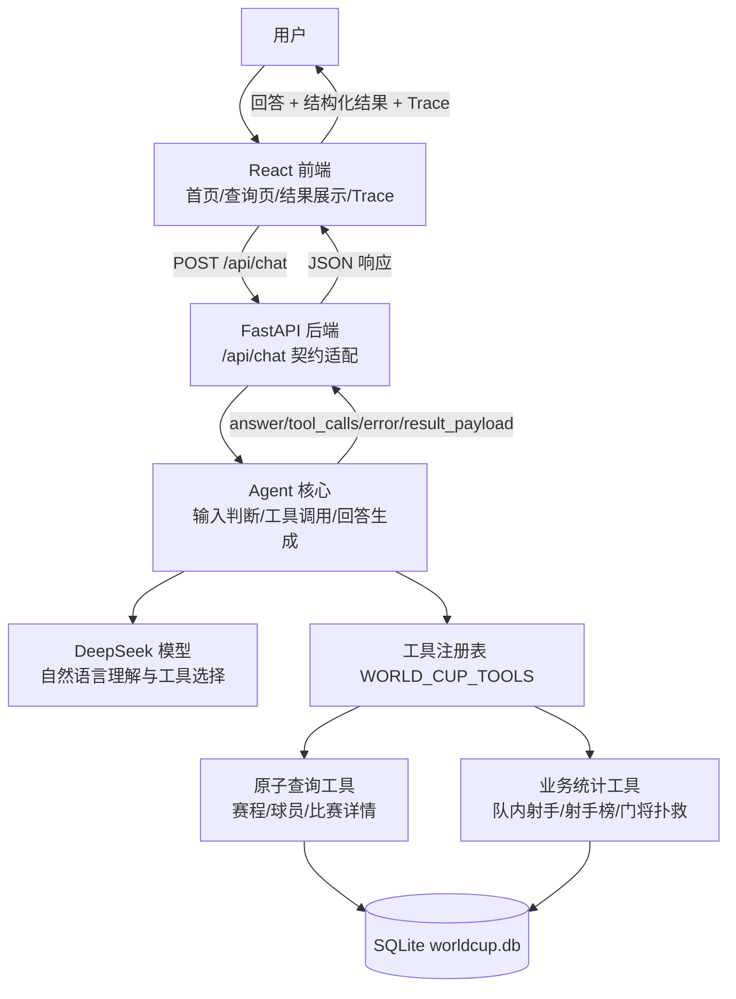

### 2.2 分层说明

| 层次 | 主要模块 | 职责 |
|---|---|---|
| 表现层 | `frontend/src` | 输入问题、展示回答和结构化结果、展示工具调用 Trace、维护前端历史、提供主题和球队视觉展示 |
| API 层 | `backend/app.py` | 提供 `/api/health` 和 `/api/chat`，转换前后端数据契约 |
| Agent 层 | `agent.py` | 构建 Agent、校验输入、识别特殊问题、调用工具、生成最终回答 |
| 工具层 | `tools/query_*.py` | 封装数据库查询能力，统一返回 `success/data/error` |
| 数据访问层 | `tools/db_helper.py` | 创建 SQLite 连接，统一数据库路径和 row factory |
| 数据层 | `tools/worldcup.db` | 存储比赛、进球事件、场上球员统计和门将统计数据 |

### 2.3 部署视图

本地开发和课程演示时，前后端分别启动：

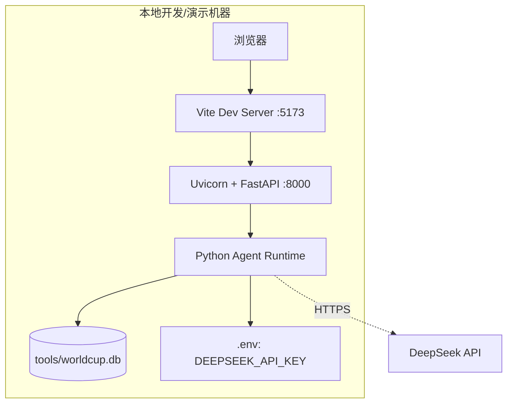

## 3. 系统功能结构

### 3.1 功能层次结构

```mermaid
flowchart TB
    Root[WorldCupAgent]

    Root --> FE[前端交互]
    FE --> FE1[首页赛事展示]
    FE --> FE2[自然语言输入]
    FE --> FE3[回答与结构化结果]
    FE --> FE4[工具 Trace]
    FE --> FE5[主题/球队视觉]

    Root --> API[后端接口]
    API --> API1[健康检查]
    API --> API2[聊天查询]
    API --> API3[历史消息接收]
    API --> API4[前端契约转换]

    Root --> Agent[Agent 核心]
    Agent --> AG1[输入兜底]
    Agent --> AG2[工具选择]
    Agent --> AG3[结果解析]
    Agent --> AG4[混合回答生成]
    Agent --> AG5[高风险推断回退]

    Root --> Tools[工具集]
    Tools --> T1[赛程/球员/比赛详情]
    Tools --> T2[排行/队内射手/射手榜]
    Tools --> T3[门将扑救]

    Root --> DB[数据库]
    DB --> D1[matches]
    DB --> D2[match_details]
    DB --> D3[players]
    DB --> D4[goalkeepers]

    Root --> Test[测试验证]
    Test --> V1[工具自测]
    Test --> V2[API/Agent 测试]
    Test --> V3[前端构建]
```

### 3.2 核心功能与模块对应

| 功能 | 前端模块 | 后端/Agent 模块 | 工具/数据模块 |
|---|---|---|---|
| 赛程查询 | `QueryPage`、`ResultShowcase`、`TraceInspector` | `chat_with_agent` | `query_schedule`、`matches` |
| 单球员数据查询 | `QueryPage`、`ResultShowcase` | `chat_with_agent` | `query_player_stats`、`players` |
| 球员排行查询 | `QueryPage`、`TraceInspector` | `chat_with_agent` | `query_players`、`players` |
| 比赛详情查询 | `QueryPage`、`ResultShowcase` | `_direct_matchup_detail_response`、`chat_with_agent` | `query_match_detail`、`matches`、`match_details` |
| 队内最佳射手查询 | `QueryPage`、`ResultShowcase` | `chat_with_agent` | `query_top_scorer_by_team`、`players` |
| 射手榜前十查询 | `QueryPage`、`ResultShowcase` | `chat_with_agent` | `query_top10_scorers`、`players` |
| 门将扑救榜查询 | `QueryPage`、`ResultShowcase` | `chat_with_agent` | `query_best_goalkeeper`、`goalkeepers` |
| 多轮比较 | `messages` 历史维护 | LangChain Agent、`_is_comparison_query` | `query_player_stats` 或 `query_players` |
| 工具调用过程展示 | `TraceInspector` | `_to_frontend_response` | `tool_calls` |
| 结构化结果展示 | `ResultShowcase` | `_to_frontend_response`，前端 `normalizeAgentResponse` | `result_payload` 或 `tool_calls[].summary` |
| 球队视觉展示 | `TeamIdentity`、`teamVisuals`、`flags/*.svg` | 无后端依赖 | 前端静态资源 |
| 异常提示 | `Alert`、消息气泡 | `_special_input_response`、工具错误解析 | 工具统一错误结构 |

## 4. 系统用例时序图及说明

### 4.1 普通赛程查询时序图

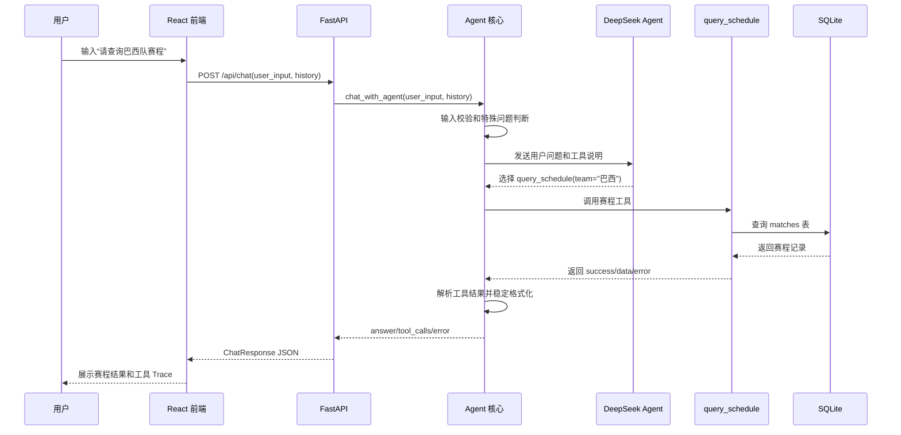

说明：

1. 前端只负责收集 `user_input` 和 `history`，不直接访问数据库。
2. Agent 负责判断是否调用工具，并将工具结果转换为稳定回答。
3. 赛程属于事实展示类问题，最终回答使用代码稳定格式化，避免 LLM 推断球队是否晋级、出线或淘汰。

### 4.2 比赛详情查询时序图

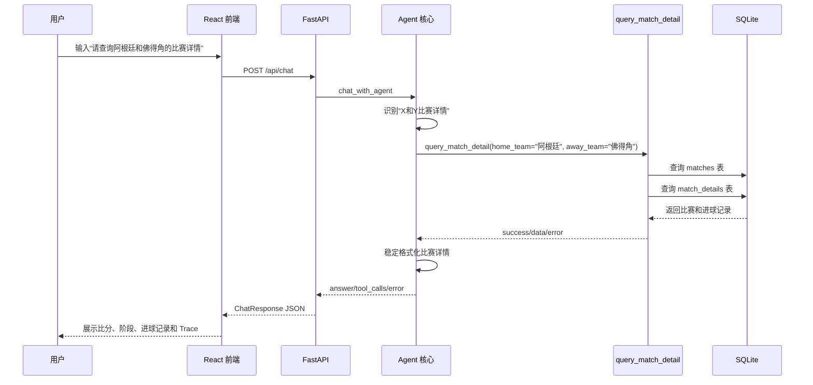

说明：

1. “X和Y的比赛详情/对阵/交手”被视为单场对阵查询。
2. 如果用户明确使用“分别”或“各自”，系统才分别查询两个球队赛程。
3. `query_match_detail` 支持主客队反向匹配，避免用户输入顺序影响查询结果。

### 4.3 多轮比较查询时序图

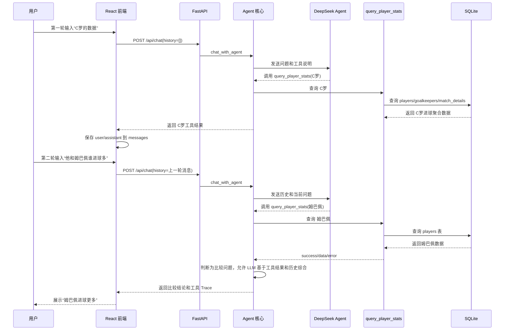

说明：

1. 前端维护短期对话历史，后端不保存用户长期历史。
2. `query_player_stats` 先查场上球员统计，再查门将统计；如果统计表未收录但比赛事件有进球记录，则用 `match_details` 聚合进球数兜底。
3. 比较类问题允许 LLM 综合当前工具结果和历史中已经由系统返回过的工具事实。
4. 综合回答仍受工具事实约束，不允许使用外部新闻、历史纪录或预测。

## 5. 复杂功能算法设计

### 5.1 Agent 查询处理与回答生成流程图

#### 5.1.1 前置判断流程

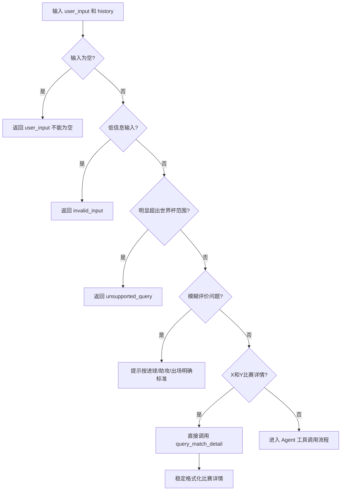

#### 5.1.2 工具执行与回答生成流程

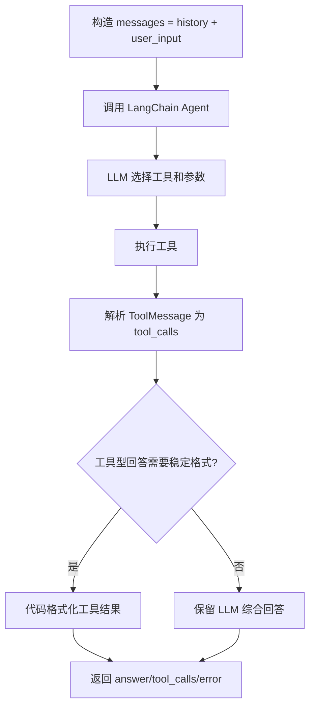

### 5.2 伪码

```text
Algorithm: chat_with_agent
Input:
  user_input: string
  history: list of {role, content}
Output:
  {answer, tool_calls, error}

1. if user_input.strip() is empty:
       return answer="请输入你的问题。", error="user_input 不能为空"

2. if user_input is low-information:
       return invalid_input response

3. if user_input is obviously unsupported:
       return supported-scope response

4. if user_input is ambiguous player evaluation:
       return metric clarification response

   Note: "最佳门将/扑救最多" is not treated as ambiguous,
         because the database has goalkeeper save fields and a dedicated tool.

5. if user_input matches "X和Y比赛详情/对阵/交手":
       call query_match_detail(home_team=X, away_team=Y)
       parse tool result
       format match detail deterministically
       return response

6. messages = history + current user message

7. call LangChain Agent with WORLD_CUP_TOOLS

8. for each AIMessage:
       collect final answer
       collect tool call name, args, id

9. for each ToolMessage:
       parse success/data/error
       attach status and summary to corresponding tool_call

10. if tool_calls exist and should_use_formatter(user_input, answer, tool_calls):
        answer = format_tool_answer(tool_calls)

11. remove internal _data field from tool_calls

12. return {answer, tool_calls, error=None}
```

### 5.3 混合回答生成策略

系统采用“稳定格式化 + LLM 综合”的混合策略。

| 问题类型 | 回答策略 | 原因 |
|---|---|---|
| 赛程查询 | 代码稳定格式化 | 避免 LLM 推断晋级、出线、淘汰等工具外事实 |
| 比赛详情查询 | 代码稳定格式化 | 避免比分、进球记录被改写 |
| 单球员数据查询 | 代码稳定格式化 | 避免扩写别名、全名或历史背景 |
| 队内最佳射手查询 | 代码稳定格式化 | 避免把“射手”误解释为门将或综合最佳球员 |
| 射手榜前十查询 | 代码稳定格式化 | 避免排行顺序、进球数被改写 |
| 门将扑救榜查询 | 代码稳定格式化 | 以 `goalkeepers` 表中的扑救次数为唯一依据 |
| 球员排行查询 | 代码稳定格式化或有限综合 | 简单排行直接格式化；比较追问允许结合历史工具事实 |
| 多轮比较查询 | 允许 LLM 综合 | 需要结合当前工具结果和历史工具事实 |
| 模糊评价问题 | 不调用模型，提示明确指标 | “最好/最强”等问题缺少唯一评价标准 |

高风险推断词包括“晋级、出线、淘汰、止步、战绩、小组第一”等。如果工具型回答中出现这类词，系统回退到稳定格式化结果。

## 6. 面向对象方法类图详细设计

当前后端以 Python 模块和函数为主，不是传统 Java 式类结构。因此类图采用“真实 Pydantic 类 + 模块职责抽象”的方式表达。

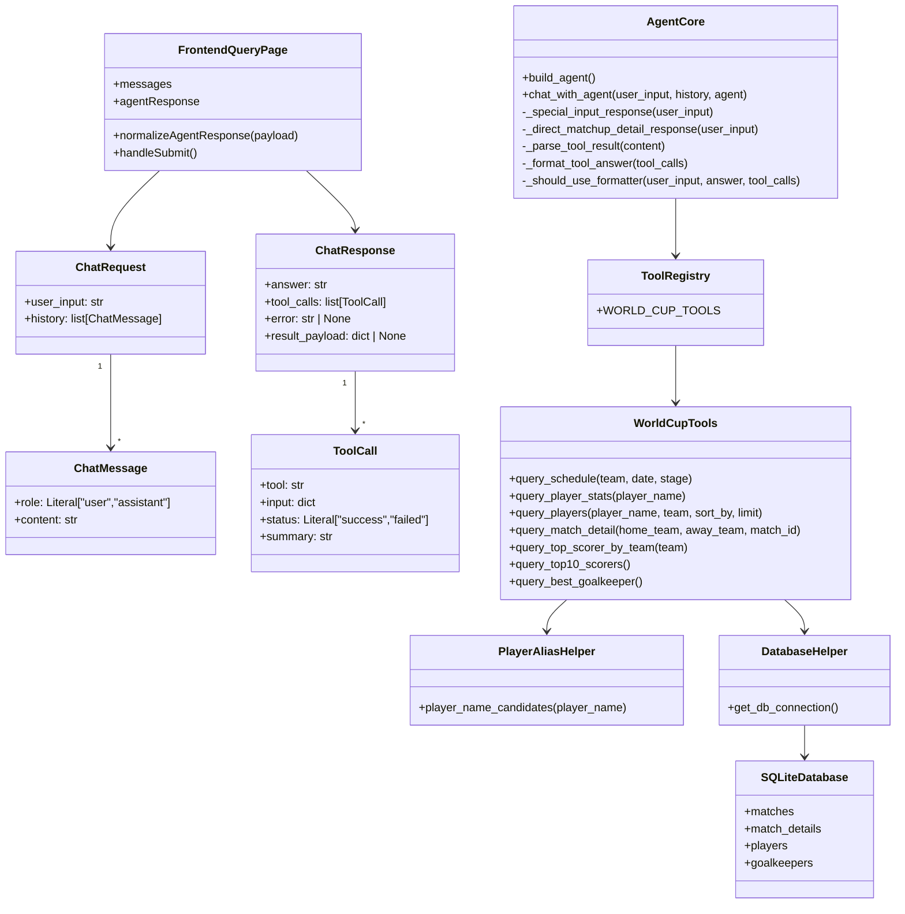

### 6.1 类与模块说明

| 类/模块 | 来源 | 说明 |
|---|---|---|
| `ChatMessage` | `backend/app.py` | 前端历史消息模型 |
| `ChatRequest` | `backend/app.py` | `/api/chat` 请求体模型 |
| `ToolCall` | `backend/app.py` | 前端 Trace 面板工具调用记录 |
| `ChatResponse` | `backend/app.py` | `/api/chat` 响应体模型 |
| `AgentCore` | `agent.py` | Agent 核心逻辑抽象 |
| `ToolRegistry` | `agent.py` | 已注册工具列表 |
| `WorldCupTools` | `tools/query_*.py` | 7 个世界杯查询工具集合 |
| `PlayerAliasHelper` | `tools/player_aliases.py` | 处理“梅西/C罗/姆巴佩”等简称和数据库全名之间的匹配 |
| `DatabaseHelper` | `tools/db_helper.py` | SQLite 连接辅助模块 |
| `FrontendQueryPage` | `frontend/src/pages/QueryPage.jsx` | 查询页状态、提交、响应归一化和结构化结果解析 |

## 7. 接口设计

### 7.1 外部 HTTP 接口

#### 7.1.1 健康检查接口

| 项目 | 内容 |
|---|---|
| 方法 | `GET` |
| 路径 | `/api/health` |
| 用途 | 判断后端服务是否在线 |

响应示例：

```json
{
  "status": "ok"
}
```

#### 7.1.2 聊天查询接口

| 项目 | 内容 |
|---|---|
| 方法 | `POST` |
| 路径 | `/api/chat` |
| Content-Type | `application/json` |
| 用途 | 接收自然语言问题和历史消息，返回回答和工具调用过程 |

请求体：

```json
{
  "user_input": "请查询梅西的世界杯进球数据",
  "history": [
    {"role": "user", "content": "C罗的数据"},
    {"role": "assistant", "content": "球员数据查询结果..."}
  ]
}
```

响应体：

```json
{
  "answer": "球员数据查询结果（当前数据库）：...",
  "tool_calls": [
    {
      "tool": "query_player_stats",
      "input": {"player_name": "梅西"},
      "status": "success",
      "summary": "{\"player_name\":\"梅西\"}"
    }
  ],
  "error": null,
  "result_payload": null
}
```

字段说明：

| 字段 | 类型 | 说明 |
|---|---|---|
| `answer` | string | 用户可读回答 |
| `tool_calls` | array | 本次查询涉及的工具调用过程 |
| `tool_calls[].tool` | string | 工具名称 |
| `tool_calls[].input` | object | 工具入参 |
| `tool_calls[].status` | string | 前端状态，取值为 `success` 或 `failed` |
| `tool_calls[].summary` | string | 工具结果摘要，成功时通常是 JSON 字符串 |
| `error` | string/null | 系统级错误；工具失败不一定导致该字段非空 |
| `result_payload` | object/null | 结构化展示扩展字段，当前后端固定返回 `null`；前端可从成功工具摘要中解析部分结构化结果 |

前端当前归一化规则：

1. 如果 `error` 不为空，前端展示错误提示，并清空结构化结果；
2. 如果存在失败的 `tool_calls`，前端将失败工具转换为用户可读失败文案；
3. 如果 `result_payload` 为空且最后一个成功工具的 `summary` 是 JSON，前端会尝试解析：
   - `query_schedule` -> `schedule` 结构化赛程；
   - `query_player_stats` -> `player` 结构化球员数据；
   - `query_match_detail` -> `match_detail` 结构化比赛详情；
4. 其他工具结果暂时以 `answer` 文本为主，同时保留 Trace 展示。

### 7.2 内部工具接口

所有工具统一返回：

```python
{
    "success": True,
    "data": ...,
    "error": None
}
```

失败时返回：

```python
{
    "success": False,
    "data": None,
    "error": "可读错误信息"
}
```

#### 7.2.1 `query_schedule`

| 参数 | 类型 | 必填 | 说明 |
|---|---|---|---|
| `team` | string/null | 否 | 球队名称 |
| `date` | string/null | 否 | 比赛日期，格式 `YYYY-MM-DD` |
| `stage` | string/null | 否 | 比赛阶段 |

功能：查询 `matches` 表，返回符合条件的赛程列表。

#### 7.2.2 `query_player_stats`

| 参数 | 类型 | 必填 | 说明 |
|---|---|---|---|
| `player_name` | string | 是 | 球员姓名 |

功能：查询单个球员数据。执行顺序为：

1. 查询 `players` 表，返回场上球员的进球、助攻、出场次数、出场分钟、红黄牌等字段；
2. 如果未命中，查询 `goalkeepers` 表，返回门将扑救次数和扑救成功率；
3. 如果统计表未收录，但 `match_details` 有进球事件，则聚合进球数作为兜底结果。

#### 7.2.3 `query_players`

| 参数 | 类型 | 必填 | 说明 |
|---|---|---|---|
| `player_name` | string/null | 否 | 球员姓名 |
| `team` | string/null | 否 | 球队名称 |
| `sort_by` | string | 否 | 排序字段，仅支持 `goals`、`assists`、`appearances` |
| `limit` | int | 否 | 返回数量，范围 1 到 20 |

功能：查询 `players` 表，支持球员筛选、球队筛选和排行榜查询。球员姓名筛选会先处理常见简称，再使用模糊匹配。

#### 7.2.4 `query_match_detail`

| 参数 | 类型 | 必填 | 说明 |
|---|---|---|---|
| `home_team` | string/null | 否 | 主队名称 |
| `away_team` | string/null | 否 | 客队名称 |
| `match_id` | int/null | 否 | 比赛 ID |

功能：查询单场比赛详情。优先按 `match_id` 查询；也支持按两支球队查询，并允许主客队顺序反向匹配。

#### 7.2.5 `query_top_scorer_by_team`

| 参数 | 类型 | 必填 | 说明 |
|---|---|---|---|
| `team` | string | 是 | 球队名称 |

功能：查询 `players` 表中指定球队进球数最高的场上球员，返回球员姓名、球队、进球、助攻、出场次数和出场分钟等字段。

#### 7.2.6 `query_top10_scorers`

| 参数 | 类型 | 必填 | 说明 |
|---|---|---|---|
| 无 | - | - | 无输入参数 |

功能：按 `players.goals` 降序查询射手榜前十，返回球员姓名、球队、进球、助攻、出场次数和出场分钟等字段。

#### 7.2.7 `query_best_goalkeeper`

| 参数 | 类型 | 必填 | 说明 |
|---|---|---|---|
| 无 | - | - | 无输入参数 |

功能：按 `goalkeepers.saves` 降序查询扑救次数最多的门将，返回门将姓名、球队、扑救次数和扑救成功率。

## 8. 数据库物理设计

### 8.1 数据库概览

数据库文件位于：

```text
tools/worldcup.db
```

数据库类型为 SQLite。当前包含四张核心表：

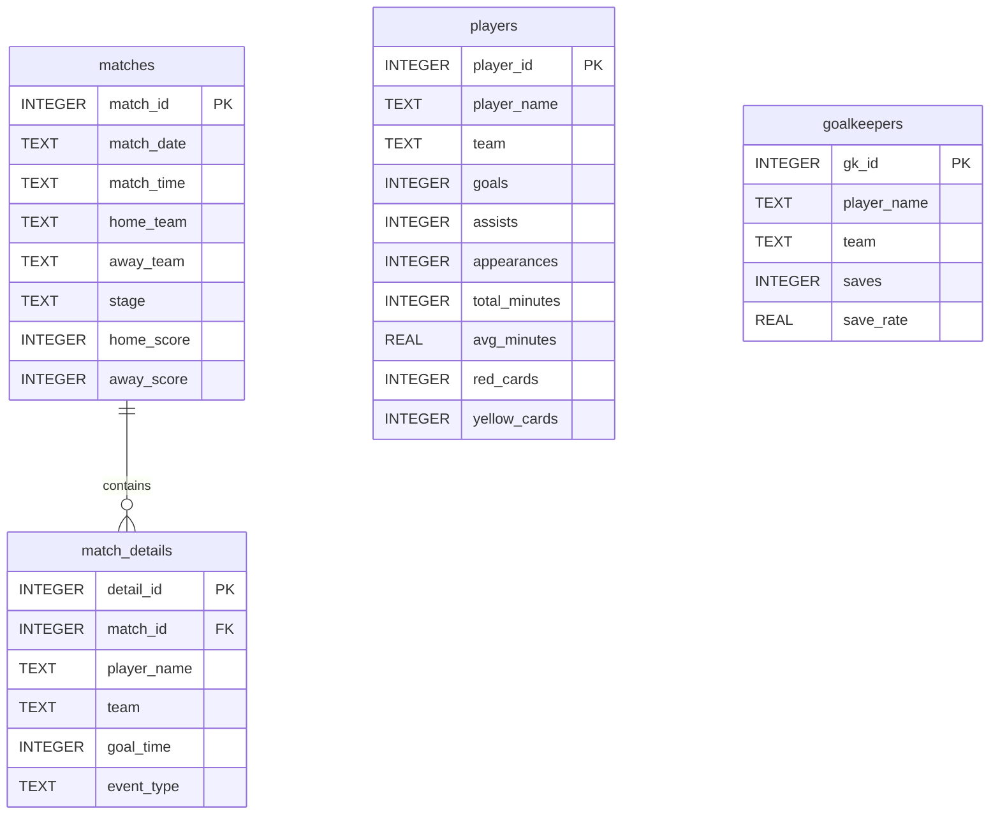

说明：

- `matches` 与 `match_details` 是一对多关系，一场比赛可以有多条进球事件；
- `players` 是场上球员统计表，用于查询总进球、总助攻、出场次数、出场分钟和红黄牌；
- `goalkeepers` 是门将统计表，用于查询扑救次数和扑救成功率；
- 当前 `players` 与 `match_details` 不做外键强绑定，避免课程演示数据维护成本过高；
- 工具层使用参数化 SQL，避免把用户输入直接拼接进条件值。

### 8.2 `matches` 表

| 字段 | 类型 | 约束 | 说明 |
|---|---|---|---|
| `match_id` | INTEGER | PRIMARY KEY AUTOINCREMENT | 比赛唯一编号 |
| `match_date` | TEXT | NOT NULL | 比赛日期 |
| `match_time` | TEXT | NOT NULL | 比赛时间 |
| `home_team` | TEXT | NOT NULL | 主队 |
| `away_team` | TEXT | NOT NULL | 客队 |
| `stage` | TEXT | NOT NULL | 比赛阶段 |
| `home_score` | INTEGER | 可空 | 主队比分 |
| `away_score` | INTEGER | 可空 | 客队比分 |

主要用途：

- 按球队查询赛程；
- 按日期查询赛程；
- 按阶段查询赛程；
- 为比赛详情查询提供基础比赛信息。

### 8.3 `match_details` 表

| 字段 | 类型 | 约束 | 说明 |
|---|---|---|---|
| `detail_id` | INTEGER | PRIMARY KEY AUTOINCREMENT | 事件唯一编号 |
| `match_id` | INTEGER | NOT NULL | 关联比赛 ID |
| `player_name` | TEXT | NOT NULL | 进球球员 |
| `team` | TEXT | NOT NULL | 所属球队 |
| `goal_time` | INTEGER | NOT NULL | 进球时间 |
| `event_type` | TEXT | DEFAULT 'goal' | 事件类型，如 `goal`、`own_goal` |

主要用途：

- 展示单场比赛进球记录；
- 支持比赛详情页面的事件时间线。

### 8.4 `players` 表

| 字段 | 类型 | 约束 | 说明 |
|---|---|---|---|
| `player_id` | INTEGER | PRIMARY KEY AUTOINCREMENT | 球员唯一编号 |
| `player_name` | TEXT | NOT NULL | 球员姓名 |
| `team` | TEXT | NOT NULL | 所属球队 |
| `goals` | INTEGER | DEFAULT 0 | 总进球数 |
| `assists` | INTEGER | DEFAULT 0 | 总助攻数 |
| `appearances` | INTEGER | DEFAULT 0 | 出场次数 |
| `total_minutes` | INTEGER | DEFAULT 0 | 总出场分钟 |
| `avg_minutes` | REAL | DEFAULT 0.0 | 场均出场分钟 |
| `red_cards` | INTEGER | DEFAULT 0 | 红牌数 |
| `yellow_cards` | INTEGER | DEFAULT 0 | 黄牌数 |

主要用途：

- 查询单个球员统计；
- 查询射手榜、助攻榜、出场榜；
- 支持多轮比较问题。

### 8.5 `goalkeepers` 表

| 字段 | 类型 | 约束 | 说明 |
|---|---|---|---|
| `gk_id` | INTEGER | PRIMARY KEY AUTOINCREMENT | 门将唯一编号 |
| `player_name` | TEXT | NOT NULL | 门将姓名 |
| `team` | TEXT | NOT NULL | 所属球队 |
| `saves` | INTEGER | DEFAULT 0 | 扑救次数 |
| `save_rate` | REAL | DEFAULT 0.0 | 扑救成功率 |

主要用途：

- 查询扑救次数最多的门将；
- 查询单个门将扑救数据；
- 避免把“最佳门将”错误地混入场上球员射手榜逻辑。

## 9. UI 界面设计

### 9.1 页面结构

当前前端主要包括首页展示区和智能查询页。首页用于展示课程演示数据和快速查询入口；智能查询页是系统核心演示入口，负责把自然语言问题发送给后端，并展示回答、结构化结果和工具调用过程。

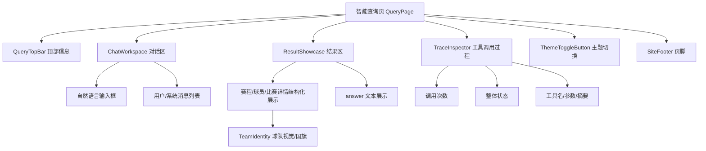

### 9.2 关键交互流程

1. 用户在输入框输入问题；
2. 前端将当前 `messages` 转换为 `history`；
3. 前端调用 `sendChatMessage(userInput, history)`；
4. 后端返回 `answer`、`tool_calls`、`error`、`result_payload`；
5. 前端通过 `normalizeAgentResponse` 统一响应结构；
6. 如果后端未返回 `result_payload`，前端尝试从成功工具的 JSON `summary` 解析赛程、球员或比赛详情；
7. 前端将用户消息和助手消息追加到对话区；
8. `ResultShowcase` 展示结构化结果或文本回答；
9. `TraceInspector` 展示工具调用过程。

### 9.3 状态设计

| 状态 | 触发条件 | UI 表现 |
|---|---|---|
| 待查询 | 尚未提交问题 | Trace 显示“待查询”，结果区显示空状态 |
| 加载中 | 请求后端中 | 输入按钮加载态，防止重复提交 |
| 成功 | 至少一个工具成功或直接回答成功 | 展示回答和工具 Trace |
| 失败 | 系统错误或工具失败 | 展示错误提示和失败工具摘要 |
| 部分成功 | 多工具调用中部分失败、部分成功 | 展示失败原因，同时展示成功工具结果 |

### 9.4 前端视觉资源设计

前端通过 `frontend/src/data/teamVisuals.js` 和 `frontend/src/assets/flags/*.svg` 管理球队视觉信息。`TeamIdentity` 组件根据球队名称读取对应视觉配置，并展示球队简称、主题色和国旗图标。

该设计的作用是：

- 让首页和查询结果不只是文本展示，而是有明确球队识别；
- 将球队视觉信息集中在数据配置文件中，避免散落在页面组件里；
- 当新增球队或替换国旗资源时，只需维护静态资源和映射表；
- 与后端解耦，后端仍只返回球队名称等事实字段。

### 9.5 UI 与 Agent 设计的关系

本系统的 UI 不只是普通聊天框，还承担“证明智能体过程”的职责。Trace 面板展示工具名称、输入参数、执行状态和结果摘要，使评审人员能够看到：

- 系统不是单纯 LLM 问答；
- LLM 通过受控工具访问数据库；
- 每次回答都有可追踪的数据来源；
- 错误和边界情况有明确反馈。

## 10. 关键数据结构设计

### 10.1 前端历史消息结构

```json
{
  "role": "user",
  "content": "C罗的数据"
}
```

前端只传递 `role` 和 `content`，不传递 UI 内部 ID。

### 10.2 Agent 工具调用记录结构

```json
{
  "tool": "query_player_stats",
  "input": {"player_name": "C罗"},
  "status": "success",
  "summary": "{\"player_name\":\"C罗\",\"team\":\"葡萄牙\"}"
}
```

该结构用于：

- 前端 Trace 展示；
- 测试断言；
- 调试工具选择是否正确；
- 答辩展示智能体调用过程。

### 10.3 工具返回结构

```json
{
  "success": true,
  "data": {
    "player_name": "利昂内尔・梅西",
    "team": "阿根廷",
    "goals": 8,
    "assists": 1,
    "appearances": 5,
    "total_minutes": 411,
    "avg_minutes": 82.2,
    "red_cards": 0,
    "yellow_cards": 0
  },
  "error": null
}
```

统一返回结构降低了 Agent 解析难度，也便于新增工具。

## 11. 异常与边界设计

| 场景 | 处理策略 |
|---|---|
| 空输入 | 直接返回“请输入你的问题”，不调用模型 |
| 纯符号或低信息输入 | 返回明确示例，不调用模型 |
| 明显超范围问题 | 返回当前系统支持范围，不调用模型 |
| 模糊评价问题 | 提示用户选择进球、助攻或出场次数等指标 |
| 最佳门将/扑救最多 | 调用 `query_best_goalkeeper`，不按场上球员射手榜处理 |
| 对阵详情无记录 | 返回比赛详情查询失败 |
| 球员简称与数据库全名不一致 | 通过 `player_aliases.py` 生成候选名再查询 |
| 球员统计表缺失但进球事件存在 | 聚合 `match_details` 中该球员进球记录作为兜底 |
| 后端未返回 `result_payload` | 前端尝试解析成功工具 `summary`，无法解析则展示 `answer` 文本 |
| 单个工具失败 | 记录失败工具并展示错误原因 |
| 多工具部分失败 | 展示失败原因，同时保留成功结果 |
| 模型服务异常 | 返回“当前无法完成请求，请稍后重试” |
| 工具型回答出现高风险推断 | 回退到代码稳定格式化结果 |

## 12. 测试与验证设计

当前测试按多层覆盖：

| 测试类型 | 文件/命令 | 目的 |
|---|---|---|
| 工具层自测 | `python test_tools.py` | 验证工具能访问 SQLite 并返回标准结构 |
| Agent 离线测试 | `python -m pytest -q` | 使用 FakeAgent 验证 Agent 输出契约和边界逻辑 |
| API 契约测试 | `tests/test_api_contract.py` | 验证 FastAPI 响应符合前端字段要求 |
| 真实模型冒烟测试 | 手动运行 `chat_with_agent` | 验证真实 LLM 能正确选择工具 |
| 前端构建检查 | `npm --prefix frontend run build` | 验证前端能正常构建 |

当前已验证的关键用例包括：

- 查询球队赛程；
- 查询单球员数据；
- 查询球员排行；
- 查询比赛详情；
- 查询队内最佳射手；
- 查询射手榜前十；
- 查询扑救次数最多的门将；
- 多轮比较；
- 空输入；
- 低信息输入；
- 超范围输入；
- 工具查询失败；
- “X和Y比赛详情”与“分别查询X和Y比赛”的歧义处理。

## 13. 后续扩展

后续可以扩展但当前未实现的功能包括：

- 接入官方或第三方实时赛事 API；
- 增加积分榜、球队排名和小组出线规则；
- 扩展球员位置、门将零封、失球、预期进球等字段；
- 增加用户登录和长期历史保存；
- 后端直接返回 `result_payload`，由前端渲染更丰富的结构化卡片；
- 增加部署配置和线上访问地址；
- 补充更完整的端到端浏览器测试。

## 14. 总结

WorldCupAgent 的系统设计重点是把 LLM 的自然语言理解能力和受控工具查询能力结合起来。系统通过 React、FastAPI、Agent、工具函数和 SQLite 数据库形成清晰分层；通过统一接口结构保证前后端协作；通过混合回答生成策略控制工具外推断；通过 Trace 面板展示工具调用过程，体现“基于大模型的工具调用智能体”这一选题要求。

本设计与当前代码实现保持一致，能够支撑课程演示、系统测试和答辩讲解。
